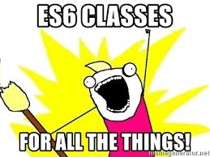

# ES6 Promises Project



This project focuses on implementing ES6 classes and understanding Object-Oriented Programming (OOP) concepts in JavaScript. Below are the tasks and objectives of the project:

## Learning Objectives

At the end of this project, you should be able to:

- Define a Class in ES6
- Add methods to a class
- Understand and implement static methods in a class
- Extend a class from another
- Explore metaprogramming and symbols in JavaScript

## Requirements

- Ubuntu 18.04 LTS with NodeJS 12.11.x is required for execution.
- Allowed editors: vi, vim, emacs, Visual Studio Code
- All files should end with a new line.
- A README.md file at the root of the project folder is mandatory.
- Code should use the .js extension.
- Testing will be done using Jest and the command `npm run test`.
- Code will be verified against lint using ESLint.
- Code needs to pass all tests and linting checks.

## Setup

1. Install NodeJS 12.11.x:

```bash
curl -sL https://deb.nodesource.com/setup_12.x -o nodesource_setup.sh
sudo bash nodesource_setup.sh
sudo apt install nodejs -y
```

2. Verify NodeJS and npm versions:

```bash
nodejs -v
npm -v
```

3. Install Jest, Babel, and ESLint:

```bash
npm install
```

## Tasks


### 0. You used to attend a place like this at some point

```javascript
export default class ClassRoom {
  constructor(maxStudentsSize) {
    this._maxStudentsSize = maxStudentsSize;
  }
}
```

### 1. Let's make some classrooms

Import the ClassRoom class from `0-classroom.js`.

Implement a function named `initializeRooms`. It should return an array of 3 ClassRoom objects with sizes 19, 20, and 34.

```javascript
import ClassRoom from "./0-classroom.js";

function initializeRooms() {
  return [
    new ClassRoom(19),
    new ClassRoom(20),
    new ClassRoom(34),
  ];
}

console.log(initializeRooms());
```

### 2. A Course, Getters, and Setters

Implement a class named HolbertonCourse with name, length, and students as attributes. Include getters and setters for each attribute.

### 3. Methods, static methods, computed methods names..... MONEY

Implement a class named Currency with code and name as attributes. Include getters and setters and a method `displayFullCurrency`.

### 4. Pricing

Import the Currency class from 3-currency.js. Implement a Pricing class with amount and currency attributes, including a method `displayFullPrice` and a static method `convertPrice`.

### 5. A Building

Implement an abstract class Building with sqft as an attribute and a getter. Ensure that any class extending Building must implement the method `evacuationWarningMessage`.

### 6. Inheritance

Implement a class named SkyHighBuilding that extends Building with additional floors attribute. Override the method `evacuationWarningMessage`.

### 7. Airport

Implement a class named Airport with name and code attributes. The default string description should return the airport code.

### 8. Primitive - Holberton Class

Implement a class named HolbertonClass with size and location attributes. When cast to Number, return size; when cast to String, return location.

### 9. Hoisting

Fix the provided code involving HolbertonClass and StudentHolberton.

### 10. Vroom

Implement a class named Car with brand, motor, and color attributes. Include a method `cloneCar` to return a new object of the class.

### 11. EVCar (Advanced)

Import Car from 10-car.js. Implement a class EVCar that extends Car with an additional range attribute. Ensure that calling `cloneCar` returns an instance of Car instead of EVCar for privacy reasons.


## Repository Information

- GitHub repository: alx-backend-javascript
- Directory: 0x02-ES6_classes